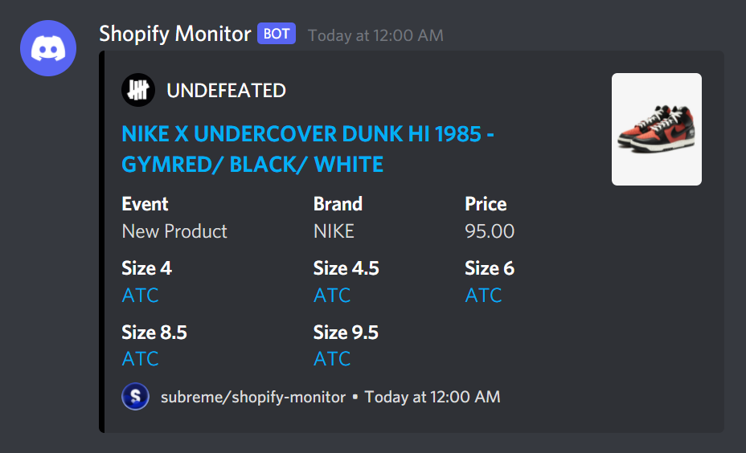
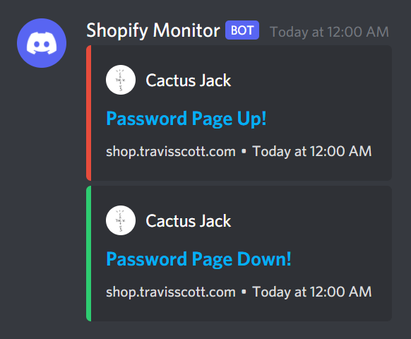

# Shopify Monitor

[](https://github.com/subreme/rust-template/)
[](https://github.com/subreme/shopify-monitor/#license)
[](https://deps.rs/repo/github/subreme/rust-template)
[](https://github.com/subreme/shopify-monitor/releases/latest/)

## Introduction

This is a simple program that monitors the `/products.json` endpoint in
online stores built on the [Shopify](https://shopify.com) platform, as
[selected by the user](#usage) in the [config file](config.json). Any
changes are notified through [Discord](https://discord.com)
[webhooks](https://support.discord.com/hc/en-us/articles/228383668-Intro-to-Webhooks).

Using the monitor, you can get alerts on Discord like this one whenever
there are updates on Shopify stores:


If minimalism is not your thing, you can edit the settings to format the
webhook embeds to your liking. A second example structure for the
webhook embeds is the following:



Apart from the store's products, the program can also detect the status
of the stores' password page, as in the embed below:



Future versions of the monitor are likely to be able to detect other
events, such as whether or not [higher levels of bot
protection](https://help.shopify.com/en/manual/checkout-settings/bot-protection)
are enabled.

## Features

The project is still a Work in Progress, therefore it will be improved
over time and gradually support more features, as indicated by the
checklist below:

- [x] Monitor multiple websites at once
- [x] Send multiple webhooks simultaneously
- [x] Allow for webhooks to be customized
- [x] Detect when the [password
  page](https://help.shopify.com/en/manual/online-store/themes/password-page)
  is up
- [ ] Detect when
  [Checkpoint](https://help.shopify.com/en/manual/checkout-settings/bot-protection)
  is enabled.
- [ ] Allow settings changes while running
- [ ] Set up the program using a CLI
- [ ] Edit settings using a Discord Bot
- [ ] Filter restocks with keywords
- [ ] Use proxies

## Installation

There are two main ways to install the monitor, as explained below:

### Releases

In almost all use-cases, the recommended way to install the program is
to download the pre-compiled binaries, which can be found in the
[Releases
page](https://github.com/subreme/shopify-monitor/releases/latest).

### Cargo

Alternatively, if your platform isn't supported, you can download the
files and compile them yourself using Cargo through the following steps:

#### Cloning

The compressed version of the source code can be downloaded
[here](https://github.com/subreme/shopify-monitor/archive/refs/heads/main.zip)
or cloned using the command line, as explained below:

- Install [GitHub CLI](https://cli.github.com) using the [official
  instructions](https://github.com/cli/cli#installation).
- Run `gh repo clone subreme/shopify-monitor`

#### Compiling

Once the repository is cloned, the code can be compiled as follows:

- Download the Rust toolchain using the [official
  documentation](https://www.rust-lang.org/tools/install).
- Navigate to the directory containing the repository's source code,
  uncompressing it if necessary.
- Run `cargo build --release`.

The binaries can then be found in `./target/release/shopify-monitor`, or
simply run by using `cargo run --release`.

## Usage

### Permissions

In order to allow the monitor to send alerts on Discord, notifying
users, it must be granted permission by a Discord Server Administrator
through a webhook URL, which can easily be generated in the Discord app.

Webhooks are created within a channel's Settings, which can be accessed
in two ways:

- Clicking on the "Settings" Icon, shaped like a gear ⚙️, when hovering
  over a channel or having it open.
- Right-clicking on the channel and selecting the "Edit Channel" option.

Once inside the Channel Settings, navigate to "Integrations", then click
on "Create Webhook" in the "Webhooks" panel and copy it's link through
the "Copy Webhook URL" button. If webhooks have already been set up for
the channel, a ist of working links can be found by clicking on "View
Webhooks" and selecting one of the available ones.

### Configuration

*Note: italicized values are optional, and can be left empty or not
included in the configuration file.*

Modifying [config.json](config.json) is currently the only way to edit
the program's settings, however [more setup options](#features) are
currently being worked on.

#### Config.json

*Note: if the program tells you your config file is invalid, look for a
message starting with* ``[HIDDEN] Failed to parse `config.json`:`` *in the
file* `shopify-monitor.log`, *which is automatically generated in the
directory the monitor is running in.*

Regardless of the method used to set up the monitor, the current plan is
to store the settings in the [config file](config.json) instead of
[environment
variables](https://en.wikipedia.org/wiki/Environment_variable),
therefore it's important to understand how it works.

Before we continue, iff you want to see *exactly* how these settings are
defined, you can check [`config.rs`](src/config.rs), while if you want
to know how they are dealt with "under the hood", you can check
[`stores.rs`](src/stores.rs). [`config.txt`](config.txt), instead,
contains a stylized version of the data the monitor converts the example
config file to. Please note that Rust's design, combined with my
inexperience both with the language and as a developer, can make for
some rather confusing code. I did my best to include several comments
explaining my reasoning and trying to help readers follow through,
however if this is not enough, feel free to ask me any questions or to
[open an issue](https://github.com/subreme/shopify-monitor/issues/new).
Now back to the explanation.

Let's start by looking at a complete Config Example:

```JSON
{
  "sites": [
    {
      "name": "Kith EU",
      "url": "https://eu.kith.com/",
      "logo": "kith",
      "delay": 5000,
    },
    {
      "name": "UNDEFEATED",
      "url": "https://undefeated.com",
      "logo": "https://pbs.twimg.com/profile_images/3186393500/eddb2592d689f63963150b01c98cc443_400x400.jpeg",
      "delay": 5000,
    }
  ],
  "servers": [
    {
      "name": "Test Server",
      "settings": {
        "username": "Shopify Monitor",
        "avatar": "https://avatars.githubusercontent.com/u/71085002",
        "color": null,
        "sizes": true,
        "thumbnail": true,
        "image": false,
        "footer_text": "subreme/shopify-monitor",
        "footer_image": "https://avatars.githubusercontent.com/u/71085002",
        "timestamp": true,
        "keywords": null
      },
      "channels": [
        {
          "name": "#kith (Europe)",
          "url": "https://discord.com/api/webhooks/123456789012345678/aBcDeFgHiJkLmNoPqRsTuVwXyZaBcDeFgHiJkLmNoPqRsTuVwXyZ",
          "sites": [
            {
              "name": "Kith EU",
              "events": [
                {
                  "restock": true
                },
                {
                  "settings": {
                    "color": "red",
                  },
                  "password_up": true,
                },
                {
                  "settings": {
                    "color": "#2ecc71",
                  },
                  "password_down": true,
                }
              ]
            }
          ]
        }
      ]
    }
  ],
  "proxies": []
}
```

*Note: some values in this purposely "complete" example had values of
`false`. This is completely unnecessary, as every
[boolean](https://en.wikipedia.org/wiki/Boolean) value in the config
file (with the exception of `combine`, which will be explained later)
defaults to `false`, so that you only have to include the toggles you
want, without having to worry about disabling features you don't want.*

This might seem overwhelming, as it was designed to fit in necessary
values so that it the format will *[hopefully]* work in future versions
of the monitor without any breaking changes.

In order to avoid sensory overload, let's visualize a briefer config
file without any confusing data.

```JSON
{
  "sites": [],
  "servers": [],
  "proxies": []
}
```

Perfect. As you can see, the file is divided in three parts, each one
being an array, which we'll analyze individually.

##### Sites

Every site in the `sites` array contains four values:

- `name`: The name the store is referenced with.
- `url`: The link to the website.
- `logo`: The company's logo, displayed in the webhook.
- `delay`: The interval, in milliseconds, between each request.

In order to ensure the configuration file isn't too confusing to read
through, every site and proxy list is given a `name` which is used as an
identifier, so that the `channel` settings, which will be explained in
the [Servers](#servers) section, can reference them. Due to this reason,
each site name must be unique.

For the same purpose, you can add names anywhere else in the file, as
due to [how](https://serde.rs) the program
[deserializes](https://en.wikipedia.org/wiki/Serialization) JSON, it
simply ignores the fields that don't match the specified types.

While the way the settings are organized would result in sub-optimal
performance if the configuration file were read and the references
searched for every time, the file is immediately parsed and its values
are stored differently in memory, as defined in
[`stores.rs`](src/stores.rs), which slightly improves the monitor's
speed.

The `url`'s uniqueness, instead, is not checked, allowing for multiple
`site`s to reference the same store, as in the example below:

```JSON
"sites": [
  {
    "name": "Kith",
    "url": "https://kith.com",
    "logo": "logo"
  },
  {
    "name": "Kith EU",
    "url": "https://eu.kith.com",
    "logo": "https://raw.githubusercontent.com/subreme/shopify-monitor/main/logos/kith.jpg",
    "delay": null
  }
]
```

The `logo` value is simply the link to an image of the store's logo,
adding to the webhook message embeds' aesthetic. To simplify the process
of having to download several images and upload them to Image Hosting
websites like [Imgur](https://imgur.com), the logos for some of the most
popular Shopify stores are included in the [logos](/logos) folder,
allowing for their links to be used in the same format as the example
above.

When using the logos included in the repo, you can simply use their
filenames as aliases, listed in the [homonymous section](#aliases).

`delay` is used to specify how long the monitor should wait (in
milliseconds) before sending another request to the selected store. It
should not be wrapped in quotation marks and, if included, the value
should be either a positive integer or `null`, as shown below:

```diff
# These are ok:
+ 1234
+ 0
+ null
+

# These won't work:
- "1234ms"
- "0"
- "null"
- ""
```

##### Servers

In order to simplify the setup process by making it more intuitive, the
each webhook and its corresponding channel is stored within the server
they're for.

Obviously, the different groups within the `servers` array don't
actually have to be unique servers, but just a collection of channels
that share common settings. In most cases, these groups will correspond
to a server, but if you can figure out how to run something more complex
using the tool, you're free to do something different.

Now, let's have a look at the `servers` section from the initial
example:

```JSON
"servers": [
  {
    "name": "Test Server",
    "settings": {
      "username": "Shopify Monitor",
      "avatar": "https://avatars.githubusercontent.com/u/71085002",
      "color": null,
      "sizes": true,
      "thumbnail": true,
      "image": false,
      "footer_text": "subreme/shopify-monitor",
      "footer_image": "https://avatars.githubusercontent.com/u/71085002",
      "timestamp": true,
      "keywords": null
    },
    "channels": [
      {
        "name": "#kith (Europe)",
        "url": "https://discord.com/api/webhooks/123456789012345678/aBcDeFgHiJkLmNoPqRsTuVwXyZaBcDeFgHiJkLmNoPqRsTuVwXyZ",
        "sites": [
          {
            "name": "Kith EU",
            "events": [
              {
                "restock": true
              },
              {
                "settings": {
                  "color": "red",
                },
                "password_up": true,
              },
              {
                "settings": {
                  "color": "#2ecc71",
                },
                "password_down": true,
              }
            ]
          }
        ]
      }
    ]
  }
],
```

As you can see, the object contains the following keys:

- `name`: the name mainly used to help keep track of things during the
  configuration process, optionally displayed in the webhook embed.
- `settings`: the server-wide settings, applying to all channels listed
  inside it, whose rules and keys are defined and explained in the [Settings](#settings) section.
- `channels`: this array contains all channels in the server, each one
  with the following properties:
  - *`name`*: the channel's name, which doesn't have to match with the
    real name or be unique as it's only used to make configuration
    easier and for logging purposes.
  - `url`: this is where the actual webhook link, obtained as instructed
    in the [Permissions](#permissions) section, is specified. In the
    future, this will most likely optionally be an array of strings,
    allowing for backup webhooks in case a [Rate
    Limit](https://discord.com/developers/docs/topics/rate-limits) is
    reached.
  - `events`: this array contains all the events, specific to the store
    they're for, which will trigger webhooks be sent in the channel,
    each one being defined using the following fields:
    - *`settings`*: [settings](#settings) that only apply to one event.
    - *`restock`*: this value determines if a webhook should be sent out
      when a product restocks.
    - *`password_up`*: this, instead, controls if a message is sent out
      when the store's password page is raised.
    - *`password_down`*: if this is enabled, a webhook will instead be
      sent out when the password page is removed.

`servers`'s many settings should allow for great customizability,
suiting almost any monitor needs.

For example, if you wanted to show a blue embed for stock updates, a red
one when the password page is raised, and a green one when the password
page is removed, you could do so by configuring the monitor similarly to
this code block:

```JSON
"servers": [
  {
    "name": "Test Server",
    "channels": [
      {
        "name": "#kith (Europe)",
        "url": "https://discord.com/api/webhooks/123456789012345678/aBcDeFgHiJkLmNoPqRsTuVwXyZaBcDeFgHiJkLmNoPqRsTuVwXyZ",
        "sites": [
          {
            "name": "atmos",
            "events": [
              {
                "restock": true
              },
              {
                "settings": {
                  "color": "red",
                },
                "password_up": true,
              },
              {
                "settings": {
                  "color": "#2ecc71",
                },
                "password_down": true,
              }
            ]
          }
        ]
      }
    ]
  }
],
```

*Note: I suggest using Discord's recommended role colors, as they were
selected by qualified designers and tend to match well with Discord's
UI. In this example, I used pure red, green, and blue for clarity,
however Discord's colors will look much better. Check the next section
for aliases to make using these colors easier.*

While the example above is a little verbose for what it does, once the
process is automated through CLI commands or a Discord Bot the setup
process should be an absolute breeze, and in the mean time no
functionality is lost.

#### Aliases

In the `config.json` examples in this file, some values stood out as
unusual, namely some values of the `logo` [URL] (for sites) and `color`
(for settings) fields. These values are aliases, meaning that they
represent something else, making it simpler to use common values.

The following are the logo URL aliases for `sites`:

| Alias             | Image                                               | Alias                       | Image                                                     | Alias        | Image                                    | Alias        | Image                                     |
|-------------------|-----------------------------------------------------|-----------------------------|-----------------------------------------------------------|--------------|------------------------------------------|--------------|-------------------------------------------|
| `afew`            |                         | `asphaltgold`               |                 | `atmos`      |            | `bodega`     |           |
| `concepts`        |                 | `extrabutter`               |                | `hanon`      |            | `jimmyjazz`  |    |
| `kith`            |                         | `notre`                     |                             | `packer`     |          | `shoepalace` |  |
| `sneakerpolitics` |  |  `travisscott` `cactusjack` |  | `undefeated` |  | `westnyc`    |        |

Before being matched against the aliases above, the values of the `logo`
fields are processed as follows:

```rs
site.logo.to_lowercase().chars().filter(|c| !c.is_whitespace()).collect::<String>().as_str()
```

What this means is that all whitespace characters are removed and the
text is converted to lowercase. As a result, you would write `Foo Bar`
instead of `foobar` and it will be recognized. Similarly to the the
images themselves, the official names to the stores (present unprocessed
in [`config.json`](config.json)) used to generate the aliases were
sourced from the official Twitter accounts of the stores.

These, instead, are the color aliases for `settings`:

| Alias                            | Color Code | Alias                                   | Color Code |
|----------------------------------|------------|-----------------------------------------|------------|
| `white`                          | #ffffff    | `black`                                 | #000000    |
| `turquoise`                      | #1abc9c    | `green`                                 | #2ecc71    |
| `blue`                           | #3498db    | `purple` `lilac`                        | #9b59b6    |
| `pink` `magenta`                 | #e91e63    | `yellow`                                | #f1c40f    |
| `orange`                         | #e67e22    | `red`                                   | #e74c3c    |
| `light` `lightgray` `light gray` | #95a5a6    | `gray` `light` `lightgray` `light gray` | #607d8b    |

#### Settings

Every settings object contains the following fields:

- *`username`*: the program can optionally override the name selected
  when the webhook was created, displayed as the sender's handle.
- *`avatar`*: similarly, the selected profile picture can also be
  overridden.
- *`color`*: the messages sent by the monitor contain embeds, as visible
  in the images at the start of this document or in the webhook
  designing website [Discohook](https://discohook.com). The custom color
  can be selected and used for the server's embeds, input in the
  hexadecimal RGB format (`#ffffff`). *(The "hashtag" `#` symbol is
  optional, and the capitalization of the value is ignored.)*
- *`sizes`*: this boolean value can be toggled to select whether the
  available sizes should be displayed along with links that will
  automatically add the product's variant to your cart.
- *`thumbnail`*: if available, a small image of the item can be
  displayed in the embed when this is set to true.
- *`image`*: alternatively (this doesn't mean that they can't both be
  enabled at once), a larger image can be displayed under the embed.
- *`footer_text`*: if set, a custom message can be shown in the
  embeds' footer.
- *`footer_image`*: a small logo, selected by including a link to its
  image, can optionally be displayed in the footer. A possible
  branding method could be to have the webhook avatar be the server's
  logo and the footer image display the monitor provider, or
  vice-versa.
- *`timestamp`*: the message timestamp can also be included in the
  footer, however this should be tested along with your footer message
  on [Discohook](https://discohook.com), as in some cases it could look
  unpleasant.
- *`keywords`*: when implemented in a future version of the monitor,
  you'll be allowed to select keywords here, so that only products that
  match the specified cases will have webhooks sent.

The same settings object can be used at several levels in the config
file, listed below in order of precedence:

1. `event`
2. `site` *(Defined as "Store" in [config.rs](config.rs))*
3. `channel`
4. `server`

The higher up on the list the "context" is, the higher the priority of
its settings, as their scope, or the number of `events` they apply to,
is narrower.

When a field's value isn't specified, the value of the same field at
the "next level", going down the list above, is also checked. If it is
given a value of `null`, instead, which can be detected thanks to the
custom `Alt` type defined in [`alternative.rs`](src/alternative.rs), the
default value is used. This also applies for the settings object as a
whole, which can be written as `"settings": null` to the same result as
the following snippet:

```json
"settings": {
  "username": null,
  "avatar": null,
  "color": null,
  "sizes": null,
  "thumbnail": null,
  "image": null,
  "footer_text": null,
  "footer_image": null,
  "timestamp": null,
  "keywords": null
}
```

#### Objects

The program allows you to use objects as a replacement for any array in
the config file, allowing for greater flexibility.

For arrays of objects with a `name` field, when they are replaced with
objects of objects the program will use the key to the nested object as
the `name` field, as shown in the example below:

```json
{
  "something": [
    {
      "name": "foo",
      "other": "bar"
    }
  ]
}
```

```json
{
  "something": {
    "foo": {
      "other": "bar"
    }
  }
}
```

From the monitor's perspective, these two code blocks are identical.

If the nested object doesn't contain a `name` field, the key will be
ignored, as shown in this other example:

```json
{
  "something": [
    {
      "setting_1": "foo",
      "setting _2": "bar"
    }
  ]
}
```

```json
{
  "something": {
    "abc123": {
      "setting_1": "foo",
      "setting _2": "bar"
    }
  }
}
```

Once again, the two hypothetical files have the same value.

To display the full extent of this feature, [`config.json`](config.json)
was rewritten to exclusively use objects in
[`config.object.json`](config.object.json), and to only use arrays (when
possible) in [`config.array.json`](config.array.json), as the "regular"
config file a combination of the two.

### Running

Once the configuration file is prepared and included in the same
directory as the binaries, the program can be started and should run
properly.

Once more features have been added, I will write guides explaining how
to deploy the monitor on a server for continuous runs.

### Logs

When the program runs, it automatically generates a file called
`shopify-monitor.log` is the same directory as the binary, as mentioned
earlier. Every message printed to the console is also logged to this
file, through the use of the
[macros](https://en.wikipedia.org/wiki/Macro_(computer_science)) defined
in [`log.rs`](src/log.rs), as well as some "hidden" messages which are
too distracting, either due to their frequency, or due to their
technicality, which makes them more suitable for debugging issues, for
them to be output to the terminal.

## License

Licensed under either of

- Apache License, Version 2.0 ([LICENSE-APACHE](LICENSE-APACHE) or
  <http://www.apache.org/licenses/LICENSE-2.0>)
- MIT license ([LICENSE-MIT](LICENSE-MIT) or
  <http://opensource.org/licenses/MIT>)

at your option.

## Contribution

Unless you explicitly state otherwise, any contribution intentionally
submitted for inclusion in the work by you, as defined in the Apache-2.0
license, shall be dual licensed as above, without any additional terms
or conditions.

See [CONTRIBUTING.md](CONTRIBUTING.md).
